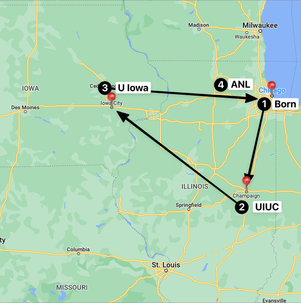
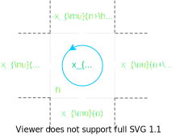
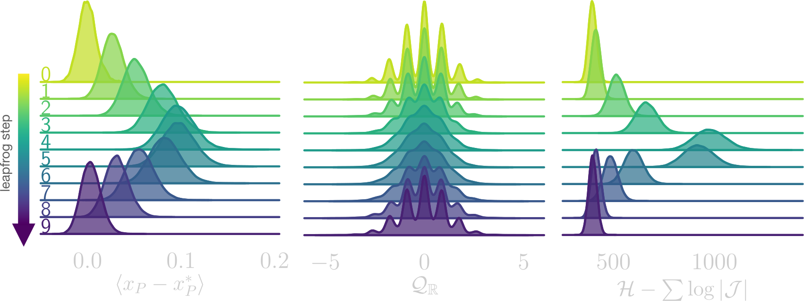
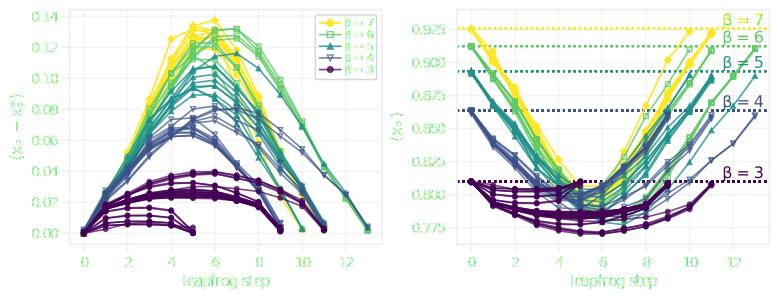

<div style="align:center;vertical-align:center;">

<h1 display=inline:block;>Machine Learning & HEP:</h1>
<h3 display=inline:block; style="line-height:1.5em;margin-bottom:5px;">How Particle Physics Prepared Me for a Career in Data Science</h3>
<br><h3><a href="https:samforeman.me">
<i class="fa fa-home faa-float"></i> Sam Foreman
</a></h3>
<h3><a href="https://twitter.com/saforem2">
<i class="fab  fa-twitter faa-float animated "></i> @saforem2</a></h3>
<br>
March, 2022

[](https://github.com/saforem2/l2hmc-qcd)

[](https://alcf.anl.gov)

<!--  -->

</div>

---

# About Me

<div id="left" style="50%;">

1. <span id="red">Born</span>: Chicago, IL

2. <span id="red">Undergrad</span>: 
  - UIUC (2010 - 2015)
    - B.S. Engineering Physics
    - B.S. Applied Math

3. <span id="red">Grad school</span>: 
  - U Iowa (2015 - 2019)
    - PhD. Physics

4. <span id="red">Postdoc</span>: 
  - ANL (2019 - ??) 
    - [Leadership Computing Facility](https://alcf.anl.gov/about/people/sam-foreman)

</div>

<div id="right" style="50%;">



</div>

---

# Quantum Chromodynamics

<div id="left" style="width=66%;font-size:1.05em;">

- <span id="red">Standard Model</span>:
    - E&M, strong and weak interactions, particles
<br>
- <span id="red">QCD</span>:
	- Strong interaction between quarks and gluons
  - Analytical progress is difficult...

</div>

<div id="right" style="width=33%;">


<br>


</div>

---

# Lattice QCD


---

## Lattice QCD

- Non-perturbative approach to solving the QCD theory of the strong interaction
  between quarks and gluons.
- Calculations in LatticeQCD proceed in 3 steps:
  1. <span id="red">Gauge Field Generation</span>: Use Markov Chain Monte Carlo (MCMC) methods
     for sampling _independent_ gauge field (gluon) configurations.
  2. <span id="red">Propagator calculations</span>: Compute how quarks propagate in these fields
     (_quark propagators_)
  3. <span id="red">Contractions</span>: Method for combining quark propagators into correlation
     functions and observables.

---
<span style="font-size: 0.9em;">

# Metropolis-Hastings

- 1946: John von Neumann, Stan Ulam, and Nick Metropolis, all at the Los Alamos
  Scientific Laboratory, cook up the Metropolis algorithm, also known as the
  Monte Carlo method${^{\color{#007DFF}{\mathrm{1}}}}$.

</span>
<div align="center" style="font-size:0.8em;">

> The Metropolis algorithm aims to obtain approximate solutions to numerical
> problems with unmanageably many degrees of freedom and to combinatorial
> problems of factorial size, by mimicking a random process. Given the digital
> computer’s reputation for deterministic calculation, it’s fitting that one of
> its earliest applications was the generation of random numbers.

</div>

<span id="halfsize">[$\mathrm{1}$]: [The Best of the 20th Century: Editors Name Top 10 Algorithms](https://archive.siam.org/pdf/news/637.pdf)</span>


---

# Metropolis-Hastings

```python
import numpy as np

def prob(x: float) -> float:
    denom = np.sqrt(2 * np.pi ** 2)
    return np.exp(-0.5 * (x ** 2)) / denom

def metropolis_hastings(steps: int = 1000):
    x = 0.                                           # initialize config
    samples = np.zeros(steps)
    for n in range(steps):
        xp = x + np.random.randn()                   # generate proposal
        if np.random.rand() < (prob(xp) / prob(x)):
            x = xp                                   # accept if xp more likely
        samples[i] = x                               # collect our samples

    return samples
```

### $1\times10^{6}$ samples <span id="red"> in $< 4s$</span>!</li></ul></span>

```python
>>> %timeit metropolis_hastings(int(1e6))
3.85 s ± 173 ms per loop (mean ± std. dev. of 7 runs, 1 loop each)
```

---

<div id="dark" style="text-align:left;">

# Results

<span id="large">

As $N\rightarrow\infty$, $p(x) \rightarrow \mathcal{N}(0, \mathbb{1})$

</span>

<div align="center">


<!--  -->

</div>

</div>

---


---

<div id='dark' style="vertical-align:center;text-align:left;">

# Motivation

- Want to calculate observables

$$
\langle \mathcal{O}\rangle\propto\int\left[\mathcal{D}x\right]\mathcal{O}(x)e^{-S(x)}
$$

- If we had <span id="red">_independent configurations_,</span> we could approximate the integral as

$$
\langle\mathcal{O}\rangle\simeq\frac{1}{N}\sum_{n=1}^{N}\mathcal{O}(x_{n})\Rightarrow \sigma^{2}=\frac{1}{N}\text{Var}\left[\mathcal{O}(x)\right]
$$

</div>

---

<div id='dark'>

# Motivation

<span style="font-size:0.8em;">

- For independent samples: 
  $$\langle \mathcal{O}\rangle \propto\int\left[\mathcal{D}x\right]\mathcal{O}(x)e^{-S(x)}
  \simeq\frac{1}{N}\sum_{n=1}^{N}\mathcal{O}(x_{n})$$
  $$\Rightarrow \sigma^{2}=\frac{1}{N}\text{Var}\left[\mathcal{O}(x\right)]$$
- Accounting for <span id="blue">autocorrelations</span>:
  $$ \sigma^{2}=\frac{\color{#228BE6}{\tau_{\mathrm{int}}^{\mathcal{O}}}}{N}\text{Var}\left[\mathcal{O}(x)\right] $$
- <span id="blue">$\tau_{\mathrm{int}}^{\mathcal{O}}$</span> is known to scale <span
  id="red">exponentially</span> as we approach physical lattice spacing.

</span>

</div>

---

<div id='dark'>

# <span style="color: #3B4CC0;">Critical Slowing Down</span>

<div id="left" style="width: 45%; font-size: 100%;text-align:left;align:left;margin-left:25pt;margin-top:20pt;font-size:1.1em;">

<h6><span id="note" style="color:rgb(123,159,249);background-color:rgba(123,159,249,0.15);">Charge Freezing</span></h6>

- <span style="color:rgb(192,212,245);font-weight:600;">$Q$ gets stuck!
<br>
<br>
- <span style="color:rgb(242, 203, 183);">$\delta Q \longrightarrow 0$</span> <span style="color:rgb(242, 203, 183);"> </span>
<br>
<br>
- <span style="color:rgb(238, 132, 104);">need to wait $N_{\mathrm{configs}}\longrightarrow \infty$</span>

<br><span id="note" style="color:rgb(255,82,82);background-color:rgba(255,82,82,0.15);padding:10px;margin-left:35pt;align:center;">
$\tau_{\mathrm{int}}^{Q} \longrightarrow \infty$
</span>

</div>

<div id="right" style="align:right;">


</div>

</div>

---

<div id='dark'>

### HMC: Leapfrog Integrator

  <!-- .element width="90%" -->

<iframe data-src="https://chi-feng.github.io/mcmc-demo/app.html"></iframe> <!-- .element width="90%" -->

</div>

---

<div id='dark'>

# Issues with HMC

- Energy levels selected randomly $\rightarrow$ <span id="red">slow mixing!</span>
- Cannot easily traverse low-density zones
- What do we want in a good sampler?
  - <span id="blue">**Fast mixing**</span> (small autocorrelations)
  - <span id="blue">**Fast burn-in**</span> (quick convergence)

 <!-- .element width="49%" -->
 <!-- .element width="49%" -->

</div>

---

<div id='dark'>

#### L2HMC: LeapfrogLayer

<div id="float" style="width:100%;align:center;">


</div>

---

<div id='dark'>

## Algorithm

<div class="column" style="width=100%;font-size:0.77em;">

1. Resample <span id="green">$\mathbf{v} \sim \mathcal{N}(0, \mathbb{1})$</span>, <span id="pink">$d\sim\mathcal{U}(+, -)$,</span> 
   construct <span id="cyan">$\xi$</span>$=(\mathbf{x}, $<span id="green">$\mathbf{v}$</span>, <span id="pink">$\pm$</span>$)$

2. Generate <span style="color:#AE81FF;">proposal $\xi^{\ast}$</span> by passing <span id="cyan">initial
   $\xi$</span> through $N_{\mathrm{LF}}$ **leapfrog
   layers**:

   <div id="note" style="width:55%;color:rgb(255, 255, 255);background-color:rgba(255, 255, 255, 0.1);text-align:center;padding:5px;">

   <span id="cyan">$\xi$</span> $ \hspace{1pt}\xrightarrow[]{\tiny{\mathrm{LF} \text{ layer}}}\xi_{1} \longrightarrow\cdots \longrightarrow \xi_{N_{\mathrm{LF}}} =$ <span style="color:#AE81FF;">$\xi^{\ast}$</span>

   </div>

3. Compute the **Metropolis-Hastings** (MH) acceptance (with Jacobian
   $\mathcal{J}$) 

   <div id="note" style="width:55%;align:center;text-align:center;padding:5px; color:rgb(255,255,255);background-color:rgba(255,255,255,0.1);padding:5px;">

   $A(\color{#AE81FF}{\xi^{\ast}}|\color{#00CCFF}{\xi})=
   \mathrm{min}\left\\{1,
   \frac{p(\color{#AE81FF}{\xi^{\ast}})}{p(\color{#00CCFF}{\xi})}\mathcal{J}\left(\color{#AE81FF}{\xi^{\ast}},\color{#00CCFF}{\xi}\right)\right\\}$

   </div>

4. <span id="red">`if training`</span>: Evaluate the **loss function** $\mathcal{L}\gets
   \mathcal{L}_{\theta}(\color{#AE81FF}{\xi^{\ast}}, \color{#00CCFF}{\xi})$ and backprop

5. Evaluate MH criteria and assign the next state in the chain according to

   <div id="note" style="width:65%;align:center;text-align:center;padding:5px; color:rgb(255,255,255);background-color:rgba(255,255,255,0.15);padding:5px;">

   $\mathbf{x}_{i+1}\gets
   \begin{cases}
     \color{#AE81FF}{\mathbf{x}^{\ast}} \small{\text{ w/ prob }} A(\color{#AE81FF}{\xi^{\ast}}|\color{#00CCFF}{\xi}) \hspace{25pt}✅ \\\\
     \color{#00CCFF}{\mathbf{x}} \hspace{14px}\small{\text{ w/ prob }} 1 - A(\color{#AE81FF}{\xi^{\ast}}|\color{#00CCFF}{\xi}) \hspace{11pt}❌
     \end{cases}$

   </div>

</div>

</div>
---

<div id='dark'>

## Toy Example: GMM $\in \mathbb{R}^{2}$


</div>

---

<div id='dark'>

### Lattice Gauge Theory

<div class="row">

<div class="column" style="width: 65%; font-size: 90%; align:right;">

<h5><b><u> <span style="color:#cfcfcf;">Link variables</span></u></b></h5>
   $U_{\mu}(x) = e^{i x_{\mu}(n)}\in U(1)$, <br>with <span id="note" style="color:rgb(255,255,255);background-color:rgba(255,255,255,0.1);padding:5px;">$x_{\mu}(n)\in[-\pi,\pi]$</span><br><br>

<h5><b><u><span style="color:#cfcfcf;">Wilson Action</span></u></b></h5>
  <span id="note"
  style="color:rgb(255,255,255);padding:5px;background:rgba(255,255,255,0.15);"> $S_{\beta}(x)
  = \beta\sum_{P} 1 - \cos \color{#00CCFF}{x_{P}}$</span>
  <span id="cyan" style="font-size:0.65em;align:right;">$x_{P}= x_{\mu}(n) + x_{\nu}(n+\hat{\mu})-x_{\mu}(n+\hat{\nu})-x_{\nu}(n)$</span>
<br><br><h5><b><u> Topological Charge</u></b></h5>

</div>

<div class="column" style="width:30%;vertical-align:center;">

  <!-- .element align="center" width="90%"-->

</div>

</div>

<div style="align=center;">

<span id="green">**Continuous:** </span> <span id="note" style="padding:8px;background:#D0F3D5;color:#1c1c1c;">✅ $Q_{\mathbb{R}} = \frac{1}{2\pi}\sum_{P} \sin x_{P}\in\mathbb{R}$ </span>

$\hspace{6pt}$ <span id="red"> **Discrete:**</span> <span id="note" style="padding:8px;background:#F7C2CC;color:#1c1c1c;text-align:right;">❌ $Q_{\mathbb{Z}} = \frac{1}{2\pi}\sum_{P} \left\lfloor x_{P}\right\rfloor\hspace{18px}\in\mathbb{Z}$</span>

  $\hspace{45pt}$ with $\left\lfloor x_{P}\right\rfloor = x_{P}-2\pi\left\lfloor\frac{x_{P}+\pi}{2\pi}\right\rfloor$</span>

</div>


  <!-- <span id="note" style="padding:8px;background:rgba(232, 245, 233,0.8);color:rgb(76, 175, 80);">✅ $Q_{\mathbb{R}} = \frac{1}{2\pi}\sum_{P} \sin x_{P}\in\mathbb{R}$ </span> -->

  <!-- <span id="note" style="padding:8px;background:rgba(255, 235, 238,0.8);color:rgb(244, 67, 54);align:right;">❌ $Q_{\mathbb{Z}} = \frac{1}{2\pi}\sum_{P} \left\lfloor x_{P}\right\rfloor\hspace{18px}\in\mathbb{Z}$</span> -->


</div>

---

<div id='dark'>

## Loss Function

<div style="font-size:0.9em;">

- Maximize the <span id="blue">_expected squared charge difference_ </span>:
  <div id="note" style="max-width=60%;">
  \[\begin{equation}
  \mathcal{L}(\theta) = \color{#228BE6}{\mathbb{E}_{p(\xi)}}
  \left[-\color{#FA5252}{{\delta Q}}^{2}_{\color{#FA5252}{\mathbb{R}}}(\xi', \xi)\cdot
  A(\xi'|\xi)\right]
  \end{equation}\]
  </div>
- Where $\color{#FA5252}{\delta Q_{\mathbb{R}}}$ is the <span id="red">tunneling rate</span>
  $$\color{#FA5252}{\delta Q_{\mathbb{R}}}(\xi',\xi)=\left|Q_{\mathbb{R}}(x') - Q_{\mathbb{R}}(x)\right|$$
- And $A(\xi'|\xi)$ is probability of accepting the proposal configuration $\xi'$.
  $$ A(\xi'|\xi) = \min\left(1, \frac{p(\xi')}{p(\xi)}\left|\frac{\partial \xi'}{\partial \xi^{T}}\right|\right\)$$

</div>

---

<div id='dark'>

#### Integrated Autocorrelation time: <span style="color:#FF2052">$\tau_{\mathrm{int}}$</span>

<div id="left" style="margin-left:6%;max-width:75%;">


</div>

<div id="right" style="align:left;text-align:left;width:30%;margin-right:15%;">

We can measure the performance by comparing $\tau_{\mathrm{int}}^{Q}$ for the
<span style="color:#FF2052">**trained model**</span> to <span
style="color:#9F9F9F;">**HMC**</span>.
</div>


</div>
---

<div id="dark">

### Integrated Autocorrelation Time


Comparison of $\tau_{\mathrm{int}}^{Q}$ for <span
style="color:#5BC461;">**trained models** </span> vs <span
style="color:#9F9F9F;">**HMC** </span> with different trajectory lengths,
$N_{\mathrm{LF}}$, at $\beta = 4, 5, 6, 7$

</div>

---


<div id="dark">

# Interpretation

<span style="font-size:0.6em; align:center;">
$\hspace{32pt}$
Deviation in $x_{P}\hspace{20pt}$
$\hspace{10pt}$ Topological charge mixing
$\hspace{20pt}$ Artificial influx of energy
</span>



<span style="font-size:0.7em;">
Illustration of how different observables evolve over a
single L2HMC trajectory.
</span>

</div>

---
<div id="dark">

## Interpretation

 <!-- .element width="48%" align="center" -->
  <!-- .element width="48%" align="center" -->

<div class="row">

<div class="column" style="font-size:0.6em;margin-left:11%;max-width:55%;text-align:center;">

<div id="note" style="color:rgb(255,255,255);background-color:rgba(255,255,255,0.15);margin-top:-40px;">

Average plaquette $\langle x_{P}\rangle$ vs lf step

</div>

</div>
<div class="column" style="font-size:0.6em;margin-left:12%;text-align:center;margin-right:4%;">

<div id="note" style="color:rgb(255,255,255);background-color:rgba(255,255,255,0.15);margin-top:-40px;">

Average energy $H - \sum\log|\mathcal{J}|$
</div>
</div>
</div>
<small><b>Fig.</b> Illustration of how the trained model artificially
increases the energy towards the middle of the trajectory, allowing the sampler
to tunnel between isolated sectors.

---

<div id="dark">

## Plaquette analysis: $x_{P}$


 <!-- .element width="100%" -->

<div class="row">
<div class="column" style="font-size:0.6em;margin-left:11%;max-width:55%;text-align:center;">

<div id="note" style="color:rgb(255,255,255);background-color:rgba(255,255,255,0.15);margin-top:-40px;">

Deviation from $V\rightarrow\infty$ limit,  $x_{P}^{\ast}$

</div>

</div>
<div class="column" style="font-size:0.6em;margin-left:12%;text-align:center;margin-right:4%;">

<div id="note" style="color:rgb(255,255,255);background-color:rgba(255,255,255,0.15);margin-top:-40px;">

Average $\langle x_{P}\rangle$, with $x_{P}^{\ast}$ (dotted-lines)
</div>
</div>
</div>
<small><b>Fig.</b> Plot showing how <b>average plaquette</b>, $\left\langle
x_{P}\right\rangle$ varies over a single trajectory for models trained at
different $\beta$, with varying trajectory lengths $N_{\mathrm{LF}}$</small>

</div>
---

<div id="dark">

# [](https://github.com/saforem2/l2hmc-qcd) [l2hmc-qcd](https://github.com/saforem2/l2hmc-qcd)

- [arXiv: 2105.03418](https://arxiv.org/abs/2105.03418)
- [arXiv: 2112.01582](https://arxiv.org/abs/2112.01582)
- [arXiv: 2112.01586](https://arxiv.org/abs/2112.01586)

- Source code publicly available

- Both `pytorch` and `tensorflow` implementations with support for distributed training, automatic checkpointing, etc.

- Generic interface, easily extensible

- <b>Work in progress</b> scaling up to 2D, 4D $SU(3)$

</div>

---

<div id="dark">

## Non-Compact Projection 
<small>[arXiv:2002.02428](https://arxiv.org/abs/2002.02428)</small>

<div style="font-size:0.8em;">

- Project $x \in[-\pi, \pi]$ onto $\mathbb{R}$ using a transformation $z = g(x)$:
  $$ z = \tan\left(\frac{x}{2}\right) $$
- Perform the update in $\mathbb{R}$:
  $$ z' = m^{t}\odot z + \bar{m}^{t}\odot \left[\alpha z + \beta\right]$$
- Project back to $[-\pi, \pi]$ using $x = g^{-1}(z)$:
  $$ x = 2 \tan^{-1}(z) $$

</div>

</div>

---

<div id="dark">

## Non-Compact Projection
<small>[arXiv:2002.02428](https://arxiv.org/abs/2002.02428)</small>

- Combine into a single update:
  $$ x' = \color{#228BE6}{m^{t}}\odot x +
  \color{#FA5252}{\bar{m}^{t}}\odot\left[2\tan^{-1}\left(\alpha\tan\left(\frac{x}{2}\right)\right)+\beta\right]
  $$
- With corresponding Jacobian:
  $$ \frac{\partial x'}{\partial x} = \frac{\exp(\varepsilon s_{x})}{\cos^{2}(x/2)+exp(2\varepsilon s_{x})\sin(x/2)} $$


</div>

---

<div id="dark">

## Acknowledgements

<div id="left">

### Collaborators:
 - Xiao-Yong Jin
 - James C. Osborn

### References:
 - [Link to slides](https://bit.ly/l2hmc-ect2021)
 - [Link to github](https://github.com/saforem2/l2hmc-qcd)
 - [reach out!](mailto://foremans@anl.gov)
 - [Link to HMC demo](https://chi-feng.github.io/mcmc-demo/app.html)
 - [arXiv:2105.03418](https://arxiv.org/abs/2002.02428)
 - [arXiv:2002.02428](https://arxiv.org/abs/2002.02428)

</div>

<div id="right">

### Huge thank you to:
 - Yannick Meurice
 - Norman Christ
 - Akio Tomiya
 - Luchang Jin
 - Chulwoo Jung
 - Peter Boyle
 - Taku Izubuchi
 - ECP-CSD group
 - ALCF Staff + Datascience Group

</div>

<small> 

<br>

This research used resources of the Argonne Leadership Computing Facility,
which is a DOE Office of Science User Facility supported under Contract
DE-AC02-06CH11357.

</small>

</div>

<style>

:root {
    --r-heading-text-transform: none;
    --r-heading-margin: 0 0 20px 0;
    --r-heading-font: "graze-pro", "OpenSans-Bold", "Open Sans", Helvetica, Impact, sans-serif;
    --r-main-background-color: #1c1c1c;
    --r-main-font: "graze-pro";
    --r-main-font-size: 34px;
    --r-block-margin: 5px;
    --r-heading-margin: 0 0 20px 0;
    --r-heading-line-height: 1.2;
    --r-heading-letter-spacing: -0.45px;
    --r-heading-word-spacing: 0.5px;
    --r-heading-text-transform: none;
    --r-heading-text-shadow: none;
    --r-heading-font-weight: 800;
    --r-heading1-text-shadow: none;
    --r-heading1-size: 2em;
    --r-heading2-size: 1.75em;
    --r-heading3-size: 1.5em;
    --r-heading4-size: 1.25em;
    --r-heading5-size: 1.1em;
    --r-heading6-size: 1.05em;
    --r-code-font: "agave Nerd Font", monospace;
    --r-link-color: #007DFF;
    --r-link-color-dark: #f92672;
    --r-link-color-hover: #63ff51;
    --r-controls-color: #228BE6;
    --r-progress-color: #404040;
    --r-selection-background-color: rgba(255, 255, 0, 0.15);
    --r-selection-color: rgb(255, 255, 0);
    --r-main-color: #c8c8c8;
    --text-muted: #757575;
    --text-faint: #404040;
    --r-heading-color: #FFF;
    --r-background-color: #fff;
    -webkit-font-smoothing:subpixel-antialiased;
}

.reveal {
    font-family: var(--r-main-font), sans-serif;
    font-size: var(--r-main-font-size);
    font-weight: normal;
    color: var(--r-main-color);
    background-color: var(--r-main-background-color);
}

.reveal h1,
.reveal h2,
.reveal h3,
.reveal h4 {
    margin: var(--r-heading-margin);
    color: var(--r-heading-color);
    font-family: var(--r-heading-font);
    line-height: var(--r-heading-line-height);
    word-spacing: var(--r-heading-word-spacing);
    text-transform: var(--r-heading-text-transform);
    text-shadow: var(--r-heading-text-shadow);
    word-wrap: break-word;
}

.reveal h1 {
    font-weight: 800;
    font-size: var(--r-heading1-size);
}

.reveal h2 {
    font-weight: 700;
    font-size: var(--r-heading2-size);
}

.reveal h3 {
    font-weight: 700;
    font-size: var(--r-heading3-size);
}

.reveal h4 {
    font-weight: 700;
    font-size: var(--r-heading4-size);
}

.reveal h5 {
    font-weight: 600;
    font-size: var(--r-heading5-size);
}
.reveal h6 {
    font-weight: 500;
    font-size: var(--r-heading6-size);
}


.reveal ul ul,
.reveal ul ol,
.reveal ol ol,
.reveal ol ul {
  margin-bottom: 10px;
}

.reveal ul:not(:last-child) {
    margin-bottom: 2px;
}

.reveal ul:last-child {
    margin-bottom: 20px;
}

.reveal ul ul {
    list-style: circle;
}
.container {
  position: relative;
}

.make-it-pop {
  filter: drop-shadow(0 0 10px purple);
}

.bottomright {
  position: absolute;
  bottom: 8px;
  right: 16px;
  font-size: 18px;
}

@media (max-width: 600px) {
  section {
    -webkit-flex-direction: column;
    flex-direction: column;
  }
}

.row {
  display: flex;
}

.column {
  flex: 50%;
}


#left {
  margin: 0 0 5px 5px;
  text-align: left;
  float: left;
  z-index: -10;
  width: 48%;
  font-size: 0.85em;
}

#right {
  margin: 0 0 5px 0;
  float: right;
  max-width: 48%;
  text-align: left;
  z-index: -10;
  width: 48%;
  font-size: 0.85em;
}

#darkBack {
    background-color: #1c1c1c;
    color: #efefef;
    .reveal a {
        color: #F92672;
        transition: color 0.15s ease;
    }
    .reveal a:hover {
        color: var(--r-link-color-hover);
    }
}

.multiCol {
    display: table;
    table-layout: fixed; /* don't fudge depending on content */
    width: 100%;
    text-align: left; /* matter of taste, makes imho sense */
    .col {
        display: table-cell;
        vertical-align: top;
        width: 50%;
        padding: 2% 0 2% 3%; /* some vertical, and between columns */
        &:first-of-type { padding-left: 0; } /* there's nothing before col1 */
    }
}

.reveal blockquote:before {
  content: "❝";
  font-size: 2.5em;
  margin-right: .05em;
  line-height: 0.1em;
  vertical-align: -0.3em;
  color: var(--text-faint);
  font-style: normal !important;
}

.reveal blockquote p {
  color: var(--text-muted);
  font-style: normal !important;
  font-align: left;
  display: inline;
}

.reveal blockquote em{
  color: var(--text-muted);
}

.reveal blockquote {
  border-radius: 8px !important;
  margin: 0.5rem 0rem 0.5rem 0rem;
  padding-top: 1rem;
  padding-left: 2rem;
  padding-bottom: 1rem;
  padding-right: 2rem;
  width: 85%;
  max-width: 90%;
  font-style: normal !important;
}

.reveal hljs {
    background: #1c1c1c !important;
}

.hljs {
    background: #202020 !important;
    border-radius: 8px !important;
}

#blue {
    color: #228BE6;
}
#bright {
    color: #00A2FF;
}
#cyan {
    color: #00CCFF;
}
#purple {
    color: #AE81ff;
}
#green {
    color: #63FF51;
}
#yellow {
    color: #FFFF00;
}
#lightpink {
    color: #E64980;
}
#pink {
    color: #F92672;
}
#red {
    color: #FA5252;
}
#grey {
    color: #666666;
}

#noteinverse {
    background-color: #1c1c1c;
    border-radius: 5px;
    border-color: #1c1c1c;
    color: #efefef;
    padding: auto;
    margin: auto;
}

#note {
    background-color: rgba(255, 255, 255, 0.1);
    padding: 5px;
    border-radius: 8px;
    border-color: rgba(240, 240, 240, 1.0);
    color: rgb(255, 255, 255);
    margin: auto;
}

#mark {
    margin: auto;
    padding: auto;
    background-color: #FFFF00;
    color: #1c1c1c;
    font-weight: 700;
    border-radius: 7px;
}

#dark {
    background-color: #1c1c1c;
    color: #efefef;
    --r-link-color: #228bE6;
    --r-header-color: #666666;
    -webkit-font-smoothing:subpixel-antialiased;
}

#halfsize {
    font-size: 0.5em;
}

#large {
  font-size: 1.25em;
}

</style>
